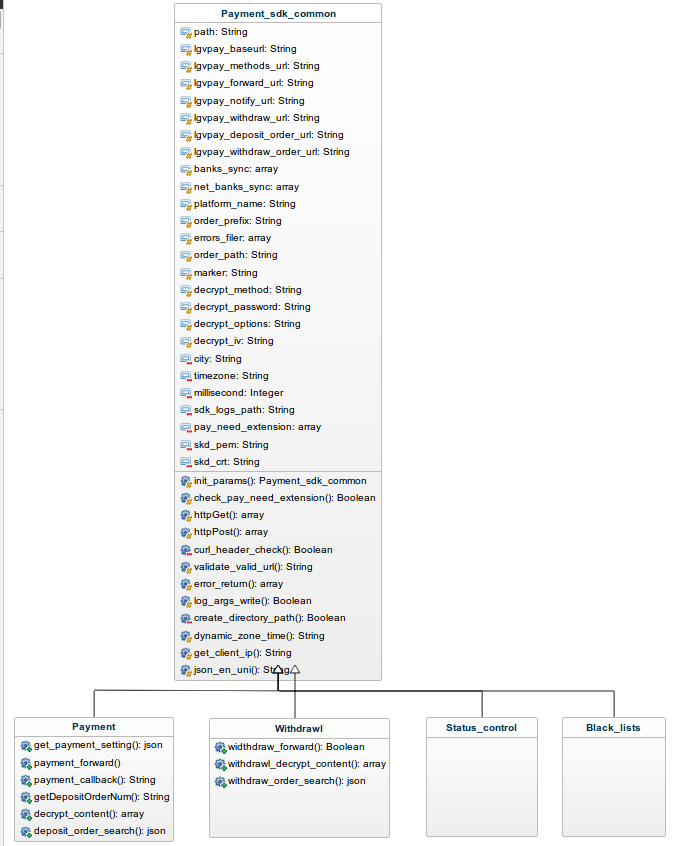

#Lgvpay 平台 SDK 的 PHP 版本文档

##### 文件夹结构

> ```
> |--sdk-php,
>
>     |-- Thirdparty_payment.php',// 所有sdk引用轴向类，只需调用此文件即可
>
>     |-- payment_sdk.php',//支付sdk
>
>     |-- withdraw_sdk.php',//提现sdk
>
>     |-- status_control.php', //待开发
>
>     |-- black_lists.php',//待开发
>
>     |-- common',
>
>         |-- Payment_sdk_common.php', //所有sdk共用函数拥有类
>
>     |-- config',
>     
>     	|-- c-qpyl.pem //pem证书文件
>     	
>     	|-- ca.crt //ca 证书文件
>
>         |-- error_info.php', //错误信息不能修改键 只能修改 【 值 】
>
>         |-- payment_sdk_config.php', //关于sdk 的配置都在此文件配置
> ```

##### sdk 里面的目录

目录下分别有两个文件夹 

1.  common（通用代码放入文件）
2.  config (配置信息文件)

与

##### sdk 相关调用文件。

1. payment_sdk.php
2. withdraw_sdk.php
3. status_control.php
4. black_lists.php

四个文件继承同样的 一个父类（common) 文件夹里面的 payment_sdk_common.php

以下是类图

##### Payment Sdk 执行类图



##### Payment 支付相关

函数有

1. get_payment_setting   （获取目前开启的所有支付渠道 ）
2. payment_forward        （提交订单生成订单数据）
3. payment_callback        （同步回调执行函数）
4. getDepositOrderNum （生成平台充值订单号）
5. decrypt_content             (充值异步回调时解密函数）
6. deposit_order_search   ( 查询充值订单号与支付系统对账)

##### Withdrawal 提款相关

函数有

1. widthdraw_forward                 (提款后台预习提交申请)
2.  withdrawl_decrypt_content  (提款异步回调时解密函数)
3.  withdraw_order_search         (查询提款订单号与支付系统对账 )

##### Status_control 支付提款状态相关

##### Black_lists  黑名单相关